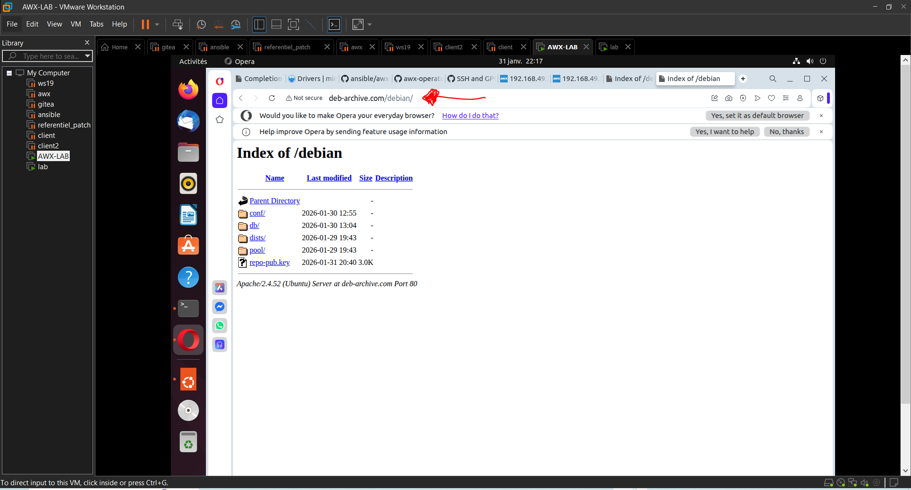

# 🚀 Déploiement d'un dépôt local HTTP LINUX à l'aide de l'outil reprepro

## 📌 Prise en main et utilisation d'un dépôt APT local 

---

## 🔧 BUT

Mettre en place un dépôt APT local accessible via HTTP, permettant d’installer et de mettre à jour des paquets Linux (et éventuellement des images ou paquets internes) de manière centralisée, sécurisée et contrôlée, sans dépendre d’une connexion Internet.

---

## 🎯 OBJECTIFS 

Voici quelques objectifs permettant l'utilisiation d'un dépôt local avec reprepro

Installer les paquets de manière sécurisée sans dépendre d'une connexion externe comme internet
Contrôler la version de paquets à installer afin de garantir une bonne sécurité
Centraliser les différentes mises à jour

---

## ⚙️ Prérequis

   1. Côté serveur
       - Linux comme système d'exploitation
       - Reprepro et apache2 ou nginx installés
       - Installlation et génération de la clé GPG
       - Adressage IP

   2. Côté client
   
      - Distribution Linux compatible APT
      - Accès réseau au serveur HTTP
      - Clé publique GPG du dépôt installée dans /etc/apt/keyrings/  

## 🏠 Présentation du dépot local

L'interface d'acceuil du dépôt local déployé sur linux se présente de la manière suivante:

## 📫 CONTACT

